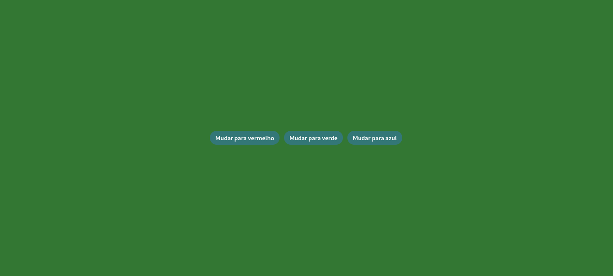

  <h1>Formulário</h1>
    
    
     
     

Este projeto utiliza JavaScript para implementar a interação com botões. Ao clicar em um botão, a cor da página muda automaticamente para a cor correspondente descrita no botão.

Desenvolvido por <a target="_blank" rel="external" href="https://github.com/MegMinnie/"><strong>Mirele Oliveira da Silva</strong></a>
 

 

 

  
  ## Como Acessar a Aplicação

Acesse a aplicação por meio do link: <a href="https://megminnie.github.io/Testando-JavaScript/">clique aqui</a>

## *Screenshots*
  

